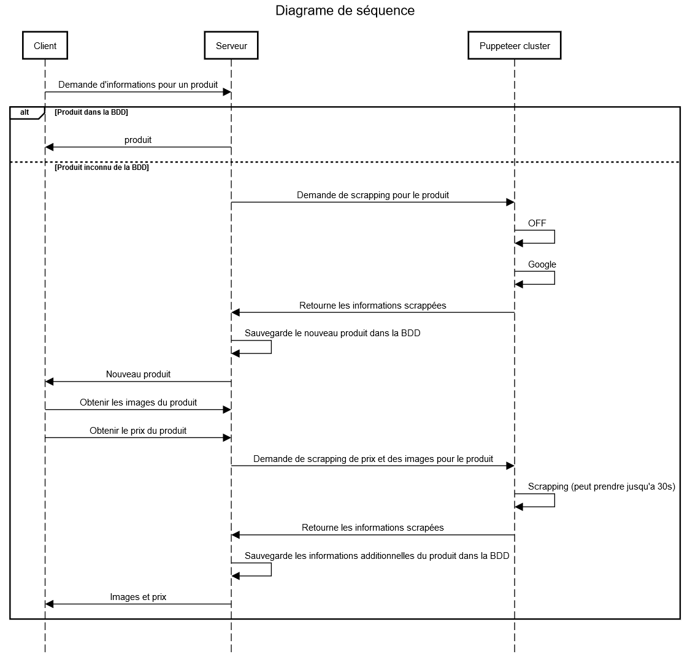

# Projet CSL

J'ai décidé d'utiliser Node.JS et EJS côté serveur et VueJS côté client comme technologies pour ce projet.

Ce projet est également disponible sur <a href="https://github.com/nicotitine/csl_project">github</a>.

## Installation

NPM et Node.JS doivent être installés sur votre machine.

Depuis un terminal, exécutez la commande `npm run i` dans le dossier racine du projet (celui contenant le fichier `package.json`)

Cette opération peut durer un moment en fonction de la vitesse de votre connexion.

## Exécution

Nous avons deux programmes à lancer (le cluster puppeteer et le serveur client), donc il vous faudra deux instances de votre terminal.

1. Pour le cluster puppeteer, exécutez la commande `npm run puppeteer` dans le dossier racine du projet. Une fois ce cluster lancé, le message suivant apparaitra :

    `Puppeteer cluster launched with 4 worker(s) and x ms of delay on port 9091`

2. Pour le serveur, exécutez la commande `npm run start` dans le dossier racine du projet. Une fois ce serveur lancé, le message suivant apparaitra :

    `Server listening on port 9090`

    

    <strong>/!\ /!\ ATTENTION</strong> : Si vous utilisez un proxy, la connexion à la base de données échouera ! <strong>/!\  /!\ </strong>

## Utilisation

Une fois les deux programmes lancés, vous pouvez vous rendre sur la page accueil du projet, se trouvant à l'adresse `http://localhost:9090`. 

Si vous souhaitez visualiser le site sur votre mobile, c'est possible en vous rendant à l'adresse `http://votre_adresse_ip_locale:9090`, `votre_adresse_ip_locale` étant l'adresse locale de l'ordinateur sur lequel `npm run start` tourne (Exemple : `192.168.1.11`).

## Fonctionnement

Pour scrapper un nouveau produit, rendez-vous dans la page de Recherche ou vous entrez un code barre valide dans le champ. Si c'est un format de code barre valide, il vous proposera d'aller scrapper le produit. Vous pouvez aussi vous rendre à l'adresse `http://localhost:9090/products/:gtin` ou `:gtin` est le code barre du produit.

1. La requête est envoyée au serveur
2. Le serveur vérifie que le produit n'est pas déjà dans la base de données
    - Si le produit est présent, retourne la page avec le produit
    - Sinon, retourne la page vide au client, ouvre une connexion WebSocket avec le client et demande au cluster puppeteer d'aller chercher les informations

3. Le cluster puppeteer répond au serveur avec les informations scrappées.
4. Le serveur envoie, grâce aux WebSocket, les informations au client pour que le produit puisse être affiché.
5. Le serveur sauvegarde les nouvelles informations scrappées.
6. Le client demande au serveur d'aller chercher les images et le prix pour ce nouveau produit.
7. Le serveur transmet la demande au cluster puppeteer.
8. Le cluster puppeteer répond avec les informations.
9. Le serveur pousse les nouvelles données vers le client pour l'affichage et sauvegarde les nouvelles informations.

### Schéma récapitulatif

## Et en cas de charge importante ?

Les opérations de scrapping sont des opérations assez lourdes: il faut ouvrir un nouvel onglet du navigateur (Chromium dans le cas de puppeteer), charger le site web, récupérer les informations,... 

Imaginons maintenant le scénario de 10 requêtes à peu près en même temps  

- Le cluster doit ouvrir 10 onglets (très lourd en mémoire - utilisation CPU)
- Charger 10 sites web différents sur les 10 onglets (très très lourd en utilisation CPU - 100%)

Il s'est déjà écoulé plusieurs secondes avant que le cluster n'ait chargé les 10 sites web. Si d'autres requêtes continuent d'arriver entre temps, le cluster continue d'ouvrir de nouveaux onglets et finira par planter.

Pour palier à ce problème, j'utilise le module `puppeteer-cluster`, visible sur  <a href="https://www.npmjs.com/package/puppeteer-cluster">npmjs.com</a>. Chaque demande de scrapping du serveur est vue comme une tâche à effectuer. Plusieurs tâches peuvent être exécutées en parallèle, mais toujours dans une limite fixée par le développeur (Dans mon cas, je limite au nombre de CPU disponibles sur la machine). Si toutes les ressources sont déjà utilisées mais qu'une nouvelle tâche arrive, elle est mise en file d'attente. 

Cependant, je n'ai pas procédé à des tests poussés.